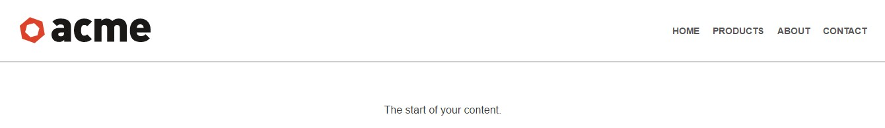

## Tutsplus - Build A Shrinking Nav Bar With CSS3 and JavaScript

In this tutorial, we learn how to build a shrinking nav bar with CSS3 and JavaScript that has become quite popular with website like desk.com.

[View demo site here.](https://webdevtuts.github.io/shrinking_navbar/)

